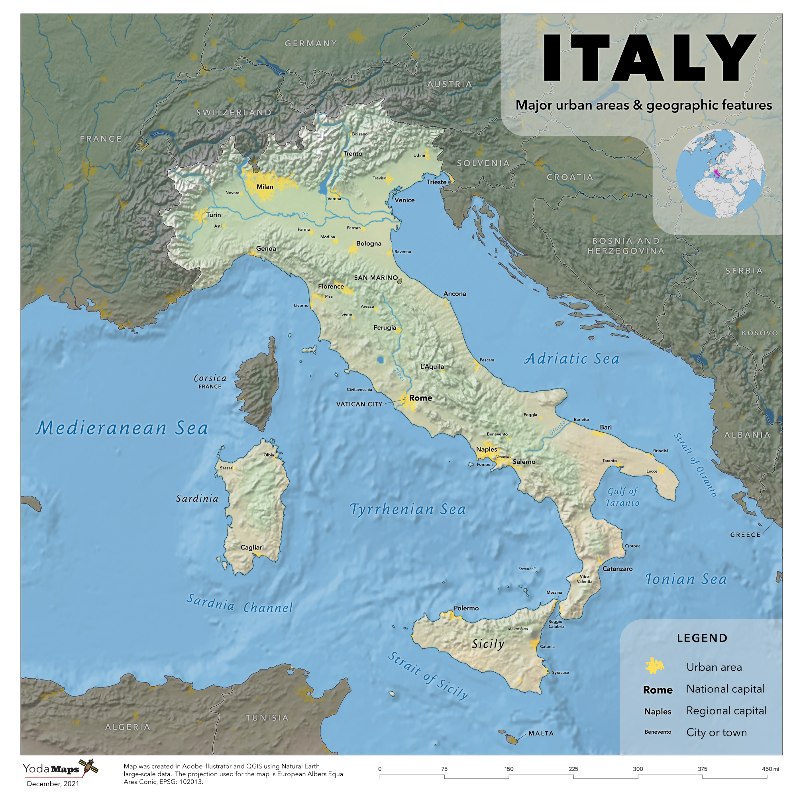

# Map of Italy
Using [Natural Earth](http://www.naturalearthdata.com/) data with QGIS and Adobe Illustrator. 

    
*Map of Italy (note at least one typo: Mediterranean Sea*

   
[Download GeoPDF](italy-map.pdf)    
